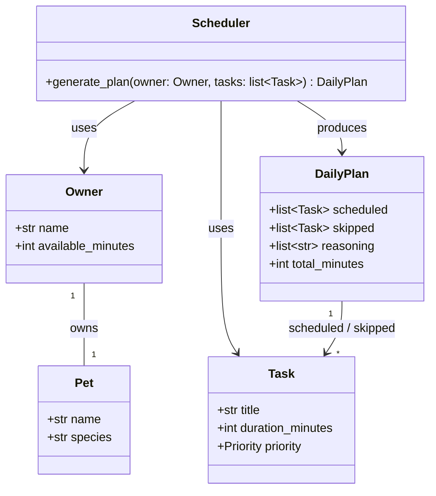

# PawPal+ UML Class Diagram



## Relationships

- `Scheduler` takes an `Owner` and a list of `Task` objects → produces a `DailyPlan`
- `DailyPlan` holds references to `Task` objects (scheduled and skipped)
- `Owner` is associated with a `Pet` (one owner, one pet in current scope)
```
